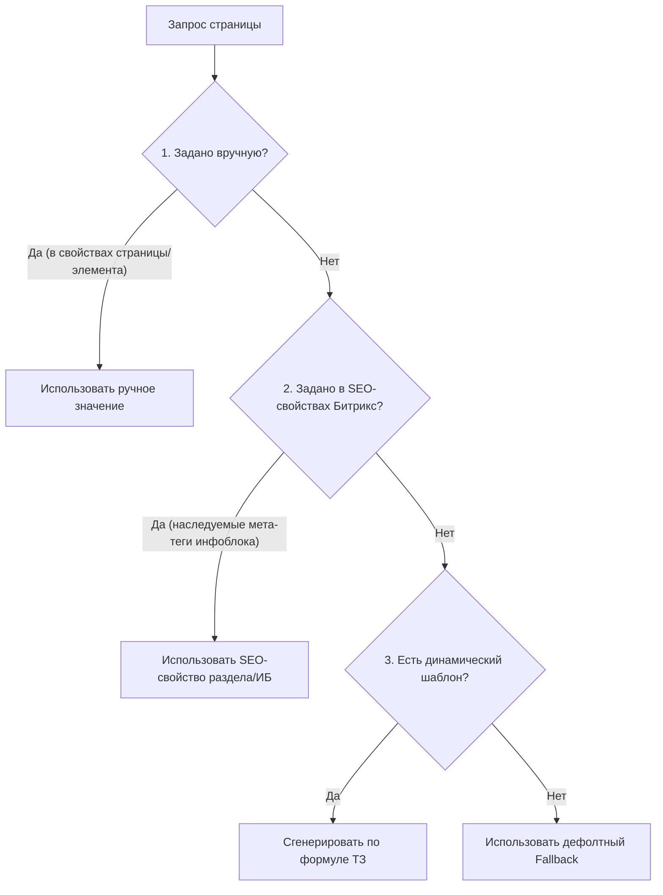

# Техническое задание: SEO-шаблоны генерации мета-тегов (Title, Description) и заголовков (H1) для MHAVE.ru

---

## 1. Общие принципы и приоритеты применения

Для исключения дублирования, пустых мета-тегов и переоптимизации, при выводе мета-данных на страницах сайта устанавливается следующая иерархия приоритетов (от высшего к низшему):

### Таблица приоритетов:
| Уровень приоритета | Источник данных | Описание |
| :--- | :--- | :--- |
| **Приоритет 1 (Высший)** | Ручное заполнение (Manual) | Мета-данные, прописанные контент-менеджером непосредственно в параметрах конкретной страницы (через файлы `.section.php` / свойства элемента). |
| **Приоритет 2** | SEO-свойства инфоблока (Bitrix SEO) | Шаблоны мета-данных, настроенные стандартными средствами 1С-Битрикс на уровне разделов каталога или инфоблока в целом. |
| **Приоритет 3** | Динамический PHP-шаблон | Автоматическая генерация по формулам на основе параметров сущности (название, цена, бренд, объем), если поля выше не заполнены. |
| **Приоритет 4 (Низший)** | Дефолтный Fallback | Базовый системный шаблон для предотвращения пустых мета-тегов. |

---

## 2. Общие требования к контенту мета-тегов

1. **Релевантность коммерческого интента**: Внедрение ключевых слов коммерческого характера: *«купить»*, *«цена»*, *«заказать»*, *«интернет-магазин»*.
2. **Гео-привязка**: Использование топонимов *«в Москве»* и *«с доставкой по России»* для привлечения регионального трафика.
3. **Уникальность бренда**: Обязательное присутствие названия магазина *«MHAVE»* или *«в интернет-магазине MHAVE»* в конце тега Title.
4. **Удобочитаемость (Snippet Optimization)**:
   - **Title**: Длина 50–70 символов.
   - **Description**: Длина 140–160 символов. Текст должен быть привлекательным для клика (CTR-оптимизация) с призывом к действию (CTA).
   - **H1**: Длина до 8-10 слов. Только название сущности, без спамных коммерческих добавок (без слов «купить», «дешево» и т.д.).

---

## 3. Формулы шаблонов по типам страниц

### 3.1. Главная страница
*   **H1**: `Профессиональная косметика, космецевтика и пищевые добавки Mhave` *(реализовано в рамках M007)*
*   **Title**: `Профессиональная косметика и космецевтика MHAVE — интернет-магазин`
*   **Description**: `Купить профессиональную косметику, космецевтику и пищевые добавки в интернет-магазине MHAVE. Оригинальная продукция премиум-брендов с доставкой по Москве и всей России.`

---

### 3.2. Разделы каталога (Категории)
*Например: Косметика, Бренды, Пищевые добавки.*
*   **H1**: `{Название Раздела}`
*   **Title**: `{Название Раздела} купить по выгодной цене в интернет-магазине MHAVE`
*   **Description**: `Широкий выбор оригинальной продукции в категории {Название Раздела}. Купить с быстрой доставкой по Москве и России в интернет-магазине MHAVE. Звоните!`
*   *Пример*:
    - **H1**: `Косметика`
    - **Title**: `Косметика купить по выгодной цене в интернет-магазине MHAVE`
    - **Description**: `Широкий выбор оригинальной продукции в категории Косметика. Купить с быстрой доставкой по Москве и России в интернет-магазине MHAVE. Звоните!`

---

### 3.3. Подразделы каталога (Подкатегории)
*Например: Уход за лицом, Сыворотки, Средства для очищения.*
*   **H1**: `{Название Подраздела}`
*   **Title**: `{Название Подраздела} купить в Москве по цене от {Мин_Цена} руб. — MHAVE`
*   **Description**: `Купить {Название Подраздела} в интернет-магазине MHAVE. Оригинальная косметика премиум-класса по цене от {Мин_Цена} руб. Быстрая доставка по Москве и РФ. Заказывайте!`
*   **Правило обработки отсутствия цены**: Если товары в подразделе временно отсутствуют или цены не заданы, формула переходит на упрощенный вариант:
    - **Title (упрощенный)**: `{Название Подраздела} купить по выгодной цене в интернет-магазине MHAVE`
    - **Description (упрощенный)**: `{Название Подраздела} в каталоге интернет-магазина MHAVE. Оригинальная профессиональная косметика с доставкой по Москве и России. Заказывайте!`
*   *Пример с ценой*:
    - **H1**: `Сыворотки для лица`
    - **Title**: `Сыворотки для лица купить в Москве по цене от 3200 руб. — MHAVE`
    - **Description**: `Купить Сыворотки для лица в интернет-магазине MHAVE. Оригинальная косметика премиум-класса по цене от 3200 руб. Быстрая доставка по Москве и РФ. Заказывайте!`

---

### 3.4. Карточки брендов
*Раздел со списком товаров конкретного производителя (например: Ultraceuticals, RejudiCare).*
*   **H1**: `{Название Бренда}`
*   **Title**: `Косметика {Название Бренда} — купить в интернет-магазине MHAVE`
*   **Description**: `Оригинальная косметика бренда {Название Бренда} в каталоге MHAVE. Официальный сайт продаж. Быстрая доставка по Москве и России, выгодные цены. Покупайте!`
*   *Пример*:
    - **H1**: `Ultraceuticals`
    - **Title**: `Косметика Ultraceuticals — купить в интернет-магазине MHAVE`
    - **Description**: `Оригинальная косметика бренда Ultraceuticals в каталоге MHAVE. Официальный сайт продаж. Быстрая доставка по Москве и России, выгодные цены. Покупайте!`

---

### 3.5. Детальные страницы товаров (Продукты)
*   **H1**: `{Название Товара}`
*   **Title**: `{Название Товара} {Объем} {Ед_Изм} купить по цене {Цена} руб. в Москве — MHAVE`
*   **Description**: `Предлагаем купить {Название Товара} ({Объем} {Ед_Изм}) по цене {Цена} руб. в интернет-магазине MHAVE. 100% оригинал, профессиональный уход. Доставка по Москве и РФ.`
*   **Правила обработки пустых свойств**:
    1. **Объем/Единица измерения не заданы**: Исключить конструкцию `{Объем} {Ед_Изм}` из шаблона.
    2. **Цена отсутствует (нет в наличии)**: Заменить `по цене {Цена} руб.` на `по выгодной цене`.
*   *Пример полного заполнения*:
    - **H1**: `Очищающая пенка Ultraceuticals Ultra Clear Foaming Cleanser`
    - **Title**: `Очищающая пенка Ultraceuticals Ultra Clear Foaming Cleanser 150 мл купить по цене 4900 руб. в Москве — MHAVE`
    - **Description**: `Предлагаем купить Очищающая пенка Ultraceuticals Ultra Clear Foaming Cleanser (150 мл) по цене 4900 руб. в интернет-магазине MHAVE. 100% оригинал, профессиональный уход. Доставка по Москве и РФ.`
*   *Пример без цены и объема*:
    - **Title**: `Крем для лица RejudiCare Synergy Embellia купить по выгодной цене в Москве — MHAVE`

---

### 3.6. Результаты индексируемых фильтров (Smart Filter / SEO-фильтры)
*Для посадочных страниц, созданных комбинацией свойств (например: Косметика + Тип кожи: Жирная + Бренд: Ultraceuticals).*
*   **H1**: `{Тип товара} {Свойство 1} {Свойство 2}`
*   **Title**: `{Тип товара} {Свойство 1} {Свойство 2} купить по цене от {Мин_Цена} руб. в интернет-магазине MHAVE`
*   **Description**: `Ищете {Тип товара} {Свойство 1} {Свойство 2}? Предлагаем широкий ассортимент оригинальной продукции по цене от {Мин_Цена} руб. Быстрая доставка из MHAVE по Москве и РФ.`
*   *Пример*:
    - **H1**: `Косметика для жирной кожи Ultraceuticals`
    - **Title**: `Косметика для жирной кожи Ultraceuticals купить по цене от 5400 руб. в интернет-магазине MHAVE`
    - **Description**: `Ищете Косметика для жирной кожи Ultraceuticals? Предлагаем широкий ассортимент оригинальной продукции по цене от 5400 руб. Быстрая доставка из MHAVE по Москве и РФ.`

---

### 3.7. Статьи и Блог
*   **H1**: `{Название Статьи}`
*   **Title**: `{Название Статьи} — Читать в блоге MHAVE`
*   **Description**: `{Лид-абзац (анонс статьи) до 140 символов} ... Полезные статьи и советы экспертов в бьюти-блоге интернет-магазина MHAVE.`
*   *Пример*:
    - **H1**: `Как правильно выбрать солнцезащитный крем`
    - **Title**: `Как правильно выбрать солнцезащитный крем — Читать в блоге MHAVE`
    - **Description**: `Разбираем SPF-фильтры, типы кожи и правила нанесения средств в летний период. Полезные статьи и советы экспертов в бьюти-блоге интернет-магазина MHAVE.`

---

### 3.8. Контентные и служебные страницы
*О компании, Доставка и оплата, Контакты.*
*   **H1**: `{Название Страницы}`
*   **Title**: `{Название Страницы} — Интернет-магазин MHAVE`
*   **Description**: `{Название Страницы} в интернет-магазине профессиональной косметики и космецевтики MHAVE. Подробная информация на официальном сайте.`
*   *Пример*:
    - **H1**: `Доставка и оплата`
    - **Title**: `Доставка и оплата — Интернет-магазин MHAVE`
    - **Description**: `Доставка и оплата в интернет-магазине профессиональной косметики и космецевтики MHAVE. Подробная информация на официальном сайте.`

---

## 4. Логика программного fallback при генерации (для разработчика)

При написании программного кода в 1С-Битрикс (в рамках задачи M009) необходимо руководствоваться следующим алгоритмом валидации переменных:

1. **Проверка строки на пустоту (trim)**: Перед подстановкой любой переменной (например, бренда или цены) необходимо обрезать пробелы и проверять её наличие.
2. **Регулярные выражения для цен**: Получать только числовое значение цены `{Цена}` без валюты и копеек.
3. **Склонения топонимов**: В мета-тегах по умолчанию используется локатив «в Москве», а не номинатив «Москва».
4. **Ограничение длины**: Обрезать сгенерированные строки с добавлением `...` на границах слов, если результирующая длина превышает:
   - Title: 80 символов.
   - Description: 180 символов.
